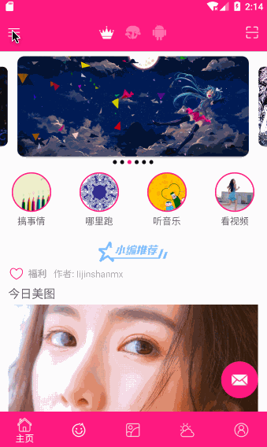
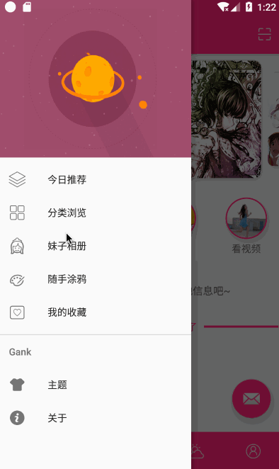
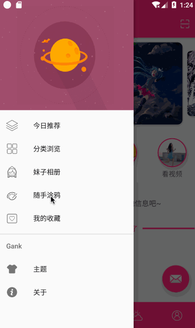

# Towards
完全按照自己的想法开发，借鉴于github许多开源项目UI。不定时上传代码。

使用的到的技术  kotlin + DataBinding + mvp + rxJava2 + retrofit + rxCache

大量dataBinding例子

目前kotlin 使用 model -- movie 包下

部分界面截图：

下载链接：

项目地址：
https://github.com/zguop/Towards

声明
--

这个属于个人开发作品。诸位勿传播于非技术人员，拒绝用于商业用途。

api和素材均来源网络，如有侵权请告知，立马删除。如果因他人下载使用产生纠纷均与本人无关

***勿大面积传播，以免被查水表谢谢合作^_^***

总结
-
xiexie ni de guāng gù ！ 喜欢的朋友轻轻右上角赏个star，您的鼓励会给我持续更新的动力。

