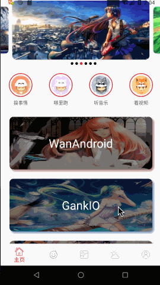
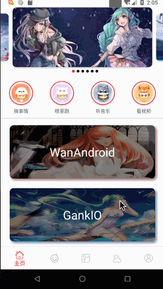

# Towards

### 项目介绍
这是一款完全按照自己的想法开发的应用，借鉴于github许多开源项目，不定时上传代码。
        
项目主要用于学习，认为觉得好的东西会使用上，
    
朝着模块化进行开发... 
对底层所有基础组件模块进行拆分，底层基础模块可以独立使用。
    
项目架构：尝试过各种模式，mvc，mvp，mvvm 项目中都有它们的影子
    
代码尽量简洁，封装性强。
   
列举一用到的库：
* kotlin: 目前更新业务代码，全部是基础kotlin编写。
* retrofit：网络请求结合rxJava
* rxJava：并没有太多的深入使用，简单应用它。
* glide：加载图片
* greenDao：用的数据库
* [banner](https://github.com/zguop/banner)：轮播图
* [statusBar](https://github.com/zguop/statusbarUtil)：沉浸式的状态栏
* [wisdom](https://github.com/zguop/wisdom):：多图片选择框架

...还有很多使用到的主流框架

##### 模块介绍
* **normal_dialog_lib**：通用的DialogFragment
* **wisdom_lib**：在依赖中可以找到，图片选择框架，纯kotlin编写
* **recycler_lib**：RecyclerView的列表和下拉刷新
* **theme_lib**：无缝切换的主题切换框架，使用于app内View视图改变。
* **imgloader_lib**：图片加载工具
* **net_lib**：网络请求
* **meta_provider_lib**：服务提供商，需要在manifest注册的

### 项目构建
由于加入了flutter模块，初始化项目需要进入到flutter目录执行 flutter packages get 命令初始化flutter，然后重新构建项目
        
### 项目截图

    
  

### 更新
    时间：
    内容：

下载链接：

声明
--

这个属于个人开发作品。诸位勿传播于非技术人员，拒绝用于商业用途。

api和素材均来源网络，如有侵权请告知，立马删除。如果因他人下载使用产生纠纷均与本人无关

***勿大面积传播，以免被查水表谢谢合作^_^***

总结
-
xiexie ni de guāng gù ！ 喜欢的朋友轻轻右上角赏个star，您的鼓励会给我持续更新的动力。

